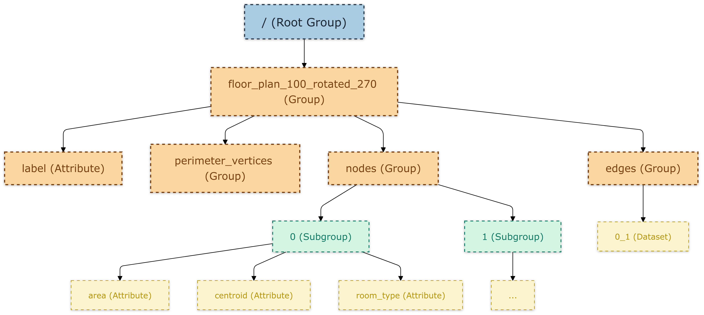

# Exploring Architectural Floor Plan Appropriateness in Context of Bangladesh Leveraging Graph Neural Networks in Spatial Context (Dataset)

This dataset was created by converting and annotating floor plan images from the RPLAN dataset into graph data, specifically tailored for the context of Bangladesh.

👉 Link to the dataset: [Click here](https://drive.google.com/file/d/1KwvM-f5E7oW3dPThaMwmrYW0W4hUa3Iy/view?pli=1)

## Dataset Structure

The dataset is organized hierarchically in an HDF5 file, where each floor plan is represented as a top-level group. Each group corresponds to a unique floor plan, identified by its ID and rotation angle, and contains several nested groups with detailed information about the floor plan’s structure.

### 1. Top-Level Structure:

Each top-level group is named using the format:  
`floor_plan_<ID>_rotated_<angle>`  
Where:

- `<ID>`: A unique identifier for each floor plan.
- `<angle>`: The degree of rotation applied to the floor plan (e.g., 0, 45, 90, etc.).

For example: `floor_plan_100_rotated_270`  
Each top-level group contains the following groups and attributes:

### 2. Components of Each Top-Level Group:

- **Attribute: label**

  - The dataset is labeled with four classes and then augmented and converted to binary classes:
    - **Label = '1'**: Graph of a floor plan applicable in the context of Bangladesh.
    - **Label = '0'**: Graph of a floor plan not applicable in the context of Bangladesh.

- **Group: perimeter_vertices**

  - Description: Contains an array that represents the vertices forming the floor plan's outer boundary. Each entry is a coordinate pair that defines the perimeter's shape.

- **Group: nodes**

  - Purpose: Stores data about individual nodes, which represent significant points within the floor plan (e.g., corners, connection points).
  - Structure: This group contains multiple subgroups, each named numerically (0, 1, 2, etc.), where each subgroup corresponds to a specific node within the floor plan.

    - **Node Attributes**: Each node subgroup includes the following attributes:
      - **area**: The area associated with the node.
      - **centroid**: The central coordinate point of the node, representing its spatial location within the floor plan.
      - **room_type**: A categorical attribute defining the type of room or space the node represents.

- **Group: edges**
  - Purpose: Stores pairs of nodes that define connections within the floor plan, such as walls or structural links.
  - Structure: This group contains multiple datasets, each named according to the nodes they connect, using the format `node1_node2` (e.g., `0_1`, `0_2`, etc.). Each dataset represents a unique connection between two nodes.

### 3. Visualization

Below is a graphical representation of the dataset structure for a floor plan:

<br>

<br>

## Function to Retrieve a Single Floor Plan

The `retrieve_modified_floor_plan` function retrieves data from an HDF5 file for a specific floor plan, identified by its PNG filename and rotation angle.

### Function Signature:

```python
retrieve_modified_floor_plan(file_path, png_filename, angle)
```

### Parameters:

- **file_path** (`str`): Path to the HDF5 file containing the floor plans.
- **png_filename** (`str`): The name of the PNG file (e.g., '1000.png') to retrieve the floor plan data for.
- **angle** (`int`): The rotation angle applied to the floor plan (e.g., 0, 90, 180, 270).

### Returns:

A dictionary with the following keys:

- **'perimeter_vertices'**: The vertices defining the floor plan's outer boundary.
- **'node_features'**: A dictionary of nodes with their corresponding attributes (e.g., area, centroid, room type).
- **'edges'**: A list of tuples representing the edges (connections) between nodes.
- **'label'**: The binary label for the floor plan (1 or 0), indicating if it is applicable in the context of Bangladesh.

If the group corresponding to the requested floor plan is not found, or an error occurs during retrieval, the function returns `None`.

### Example Usage:

```python
file_path = "floorplans_rotated_with_labels_all_used_for_training_58k.hdf5"
png_filename = '1000.png'
angle = 270
floor_plan_data = retrieve_modified_floor_plan(file_path, png_filename, angle)
print(floor_plan_data)
```
